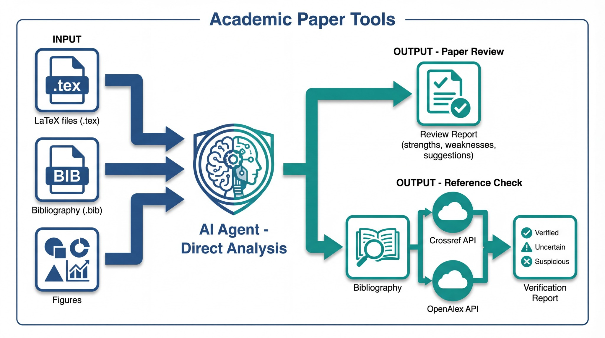

[English](README.md) | [中文](README_CN.md)

<p align="center">
  
</p>

# Academic Paper Tools

[](https://opensource.org/licenses/MIT)
[](https://www.python.org/downloads/)

Agent-native tools for academic paper workflows. Works with any AI coding assistant that supports Agent mode (Cursor, Claude Code, Windsurf, Cline, etc.).

<p align="center">
  
</p>

## Design Philosophy

These skills are designed as **Agent-native** tools:

- **No external LLM calls** - The AI Agent itself analyzes content directly
- **Direct file access** - Reads TeX source, figures, and bibliography files natively
- **Minimal dependencies** - Only calls external APIs when necessary (e.g., bibliographic databases)
- **LaTeX-first** - Optimized for TeX projects, reading source files for better analysis

## Available Skills

### 1. Paper Review (`paper-review/`)

AI-powered academic paper review that analyzes LaTeX source files directly.

**Features:**
- Reads `.tex` files to understand paper structure and content
- Analyzes figures for visual quality
- Checks bibliography completeness
- Provides structured review with specific file/line references

**Usage:**
```
"Review my paper in the release/ folder"
"Give me feedback on the experiments section"
"What are the weaknesses of this paper?"
```

### 2. Reference Check (`ref-check/`)

Verifies BibTeX references against academic databases (Crossref, OpenAlex).

**Features:**
- Parses `.bib` files directly
- Queries free academic APIs (no API key required)
- Detects title mismatches, year errors, missing papers
- Suggests corrections

**Usage:**
```
"Check the references in main.bib"
"Verify my citations"
"Are there any suspicious references?"
```

**Example Output:**
```
✅ Verified: 38/45 (84%)
⚠️ Uncertain: 5/45 (11%)
❌ Suspicious: 2/45 (5%)

[SUSPICIOUS] fabricated2023
  Title: A Novel Approach to Everything...
  Issue: No matching papers found in any database
  
[UNCERTAIN] smith2020deep
  Title: Deep Learning Methods...
  Best match (sim=0.72): Deep Learning Methods for Computer Vision...
  ⚠️ Title inconsistent (sim=0.72)
```

## Installation

### Option 1: Copy to Skills Directory

**Cursor:**
```bash
# Windows
Copy-Item -Recurse .\paper-review\ "$env:USERPROFILE\.cursor\skills\paper-review"
# macOS/Linux
cp -r ./paper-review ~/.cursor/skills/
```

**Claude Code:**
```bash
cp -r ./paper-review ~/.claude/skills/
```

**Other AI Assistants:**
Follow your tool's documentation for adding custom skills/prompts.

### Option 2: Use Directly in Project

Place the skill folders in your project directory. Most AI assistants will automatically pick up SKILL.md or similar files.

## Why Agent-Native?

Traditional approaches call external LLM APIs from scripts:

```
❌ Old: User → AI Agent → Python Script → OpenAI API → Response
```

This is redundant - the AI Agent already IS a powerful LLM!

```
✅ New: User → AI Agent (directly analyzes files) → Response
```

**Benefits:**
- **Faster** - No extra API roundtrips
- **Cheaper** - No additional API costs
- **Better context** - Agent sees full project structure
- **More precise** - Can reference exact file locations

## Why TeX Source Over PDF?

For LaTeX projects, reading source files is superior to PDF:

| Aspect | PDF | TeX Source |
|--------|-----|------------|
| Text quality | May lose formatting | Perfect |
| Math formulas | Often garbled | Original LaTeX |
| Structure | Must infer | Explicit sections |
| Figures | Compressed | Original quality |
| Editability | "Page 5, paragraph 2" | "line 42 in method.tex" |

## Project Structure

```
academic-paper-tools/
├── paper-review/
│   ├── SKILL.md          # Main skill definition
│   └── prompts.md        # Evaluation criteria & templates
├── ref-check/
│   ├── SKILL.md          # Main skill definition
│   ├── reference.md      # API documentation
│   └── scripts/
│       └── check_references.py  # Standalone verification script
├── examples/
│   ├── sample.bib        # Sample BibTeX for testing
│   └── sample_report.md  # Example output report
├── requirements.txt      # Python dependencies
├── LICENSE               # MIT License
├── CONTRIBUTING.md       # Contribution guidelines
├── README.md
└── README_CN.md
```

## Requirements

- Any AI coding assistant with Agent mode (Cursor, Claude Code, Windsurf, Cline, etc.)
- No additional dependencies for paper-review
- Internet connection for ref-check (API queries)

## License

MIT License

## Acknowledgments

**Inspired by:**
- [PaperDecision](https://github.com/PaperDecision/PaperDecision) - Multi-agent paper review concepts
- [RefCheck.ai](https://github.com/HuaHenry/RefCheck_ai) - Reference verification methodology

**Data Sources:**
- [Crossref](https://www.crossref.org/) - Free scholarly metadata API
- [OpenAlex](https://openalex.org/) - Open catalog of scholarly works
